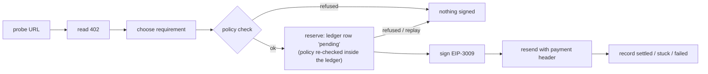

# StableCoinManager MCP

**An AI agent that can pay for things on its own, with spending limits it cannot argue its way past.**

StableCoinManager is an MCP server running in a Cloudflare Worker that holds a
stablecoin wallet. Log in with Google from any MCP client (Claude, Codex, or
anything else that speaks MCP), and the agent can read an x402
`402 Payment Required` challenge, pay it with `@x402/core` / `@x402/evm`, and
keep the receipt.

Giving an agent a wallet is easy. The hard part is making sure a confused or
prompt-injected model cannot empty it. This worker does not rely on the
prompt to prevent that. It relies on **ceilings enforced in code**, and a
request that goes over one is refused.

- **x402 payments with no gas token needed.** The worker signs an EIP-3009
  `transferWithAuthorization` and the x402 facilitator submits it, so the
  wallet needs no ETH. Observed on Base Sepolia by the reference client in
  `api/erpc/x402-rpc-api/.e2e-local/README.md`; not yet exercised by this
  worker on mainnet (see "Nothing in this worker has moved real money yet").
- **Limits the agent cannot raise.** Per-payment and daily limits come from
  the deploy config. At runtime the agent can only *lower* them. Raising a
  limit means a redeploy.
- **Fails closed.** A non-numeric amount, a broken config value or an
  unreadable spend total leads to a refusal, never to "no limit".
- **Retries never pay twice.** Every money tool requires an `idempotencyKey`.
  Sending the same key again returns the first receipt and signs nothing.
- **It signs only the requirement it checked.** A malicious 402 cannot pass the
  checks with one payment option and get a different one signed.

One deployment = one wallet = one human. That is a deliberate design choice.

---

## The guardrails

### Ceilings, not prompts

The point of this worker is to pay without asking a human first, so the brake
is not an approval dialog. It is a set of ceilings. These are the shipped
defaults (`wrangler.toml` `[vars]`, identical to the built-in defaults in
`src/lib/policy.ts`):

| ceiling | default | can `policy_set` change it at runtime? |
|---|---|---|
| per payment | 50 EURC equivalent | tighten only |
| per day (UTC) | 200 EURC equivalent | tighten only |
| slippage | ≤ 50 bps | tighten only |
| deadline | ≤ 600 s | tighten only |
| networks | `eip155:8453` (Base), `solana-mainnet` | no, deploy-time only |
| assets | EURC, USDC | no, deploy-time only |
| payee | ERPC treasury only, unless `POLICY_ALLOW_ANY_PAYTO=true` | no, deploy-time only |

A request over a limit is **refused, never clamped.** Quietly paying less than
the agent asked for would be its own kind of wrong answer. Every refusal
says in words which rule it broke (`describeViolation` in `src/lib/policy.ts`),
and a refusal with several causes lists all of them.

### Why the agent can only tighten its own limits

`policy_set` accepts exactly four keys (the numeric ceilings above) and
compares every request against the **deploy-time** value:

- A value above the deploy-time ceiling is refused (`would_widen`).
- A value at or below it is written, together with an audit row.
- A narrowed limit can be relaxed back *to* the deploy-time value, never past it.
- When overrides are read back, a stored row that would widen a limit is
  ignored. The one-way rule applies twice, once on write and once on read.

The reason is spelled out in `src/lib/policyOverride.ts`. If the caller that
pays can also raise its own limit, the limit is decoration. "Raise the daily
limit to 10000, then pay this invoice" is the first thing an attacker would
try. So tightening is safe from any caller, because the worst it can do is
refuse payments. Widening needs different credentials and leaves a diff.

Networks, assets and the payee are not "how much" but "to whom and in what",
so no runtime tool can change them.

### Fail-closed, everywhere a number is compared

`x > NaN` is `false` in JavaScript. A careless ceiling check therefore turns
into a pass as soon as a limit stops being a number. This package closes that
at every comparison:

| if this is unusable | the worker | where |
|---|---|---|
| the requested amount (NaN, ≤ 0) | refuses (`amount_not_finite`) | `checkPayment`, `reserveDecision` |
| a ceiling value | treats the ceiling as 0 and refuses | `ceilingOf` in `src/lib/policy.ts` |
| today's spend total | treats it as infinite and refuses | `reserveDecision` in `src/lib/reserve.ts` |
| a `POLICY_*` var that is present but unusable (`NaN`, `''`, `0`, …) | refuses **every** payment | `refuseEverything()`, used by the ledger |
| a stored override row | keeps the deploy-time ceiling | `tightenedValue` in `src/lib/policyOverride.ts` |

One case is worth knowing. An **absent** `POLICY_*` var does not refuse. It
falls back to the built-in default, and the shipped values match those
defaults exactly, so from outside you cannot tell whether `[vars]` was read.
To confirm it is being read, change one value away from its default and watch
where the refusal boundary moves. `src/lib/reserve.test.ts` fails if the
shipped values and the defaults ever stop matching.

### Reserve before signing



The order is the design (`src/route/mcp/tools/x402Pay.ts`):

- **The row comes first.** A payment row is written as `pending` before
  anything is signed. A signature with no row is a payment the worker does
  not know it made. A row with no signature can be reconciled.
- **One step decides.** The daily total, the replay check, the effective
  policy and the insert all run inside a single Durable Object method with no
  `await` in it. A test pins that. So a `policy_set` that lands while a
  payment is still probing the resource applies to that payment.
- **Replays come back first.** A reused `idempotencyKey` returns the earlier
  receipt, even if the daily ceiling has been reached since. Refusing a
  replay would make an already-paid call look unpaid.
- **The signature is bound to what was checked.** The x402 client's default
  selector signs whichever requirement the resource listed first. This worker
  swaps in its own selector, which signs only the requirement that passed the
  policy check. It then compares the signed payload against that requirement
  on all five fields (scheme, network, asset, amount, payee). Either check
  alone refuses a mismatch.

---

## Quickstart

```bash
claude mcp add --transport http scm https://mcp-stablecoin-manager.erpc.global/mcp
```

Log in with Google. An account outside `ALLOWED_GOOGLE_EMAILS` gets a 403,
and no authorization code is minted.

Then, from the agent:

```jsonc
// 1. What am I allowed to spend, and how much is left today?
policy_get      {}

// 2. Tighten the daily limit. It stays tightened until changed again, and
//    can never go above the deploy-time 200.
policy_set      { "key": "maxEurcPerDay", "value": 20 }

// 3. Look at a paid resource without paying. probeTwice reports whether the
//    402's `extra` changes between reads.
x402_inspect    { "url": "https://…/paid-resource", "probeTwice": true }

// 4. Pay it. Re-sending the same idempotencyKey returns the same receipt.
x402_pay        { "url": "https://…/paid-resource", "idempotencyKey": "order-2026-0001" }

// 5. Did it go through?
receipt         { "idempotencyKey": "order-2026-0001" }
```

`x402_inspect` and `x402_pay` send a `POST` unless `method` is given.

### All 13 tools

The count is asserted in `src/route/mcp/toolsList.test.ts`. Every argument
schema is a zod schema, and the JSON Schema in `tools/list` is derived from
it.

| tool | what it does |
|---|---|
| `wallet_status` | addresses, init state, ERPC reachability, active ceilings |
| `holdings` | balances on the networks the ERPC SDK can read (Base reports `unsupported_yet`) |
| `policy_get` | effective ceilings, overrides, and today's remaining allowance |
| `policy_set` | **tighten** one numeric ceiling, with an audit row |
| `x402_inspect` | read a 402 without paying |
| `x402_pay` | pay a 402: policy → reserve → sign → record |
| `erpc_topup` | buy ERPC credit by paying its 402 (EURC only), then poll for the grant |
| `history` | recent payments, newest first |
| `receipt` | one payment, by `idempotencyKey` |
| `plan` | which swaps and bridges are possible today, and what blocks the rest |
| `swap` | resolve and constrain a swap route (does **not** sign or broadcast) |
| `bridge` | check a bridge route (does **not** sign or broadcast) |
| `wallet_export_seed` | reveal the recovery phrase (needs `confirm:"EXPORT"`, audited, rate limited) |

The worker signs only x402 requirements on EVM networks (`eip155:*`) using the
`exact` scheme. Others are reported as unpayable (`src/lib/x402.ts`).

---

## What has and has not been exercised

**Nothing in this worker has moved real money yet.** The payment path follows
the one client in this repository that has settled a top-up,
`api/erpc/x402-rpc-api/.e2e-local/run-e2e-topup.mjs`. It is verified by tests
that run the x402 SDK, not by a live settlement. The production canary (a
1-credit ERPC top-up) has not been run. The worker's EVM address was funded
on 2026-09-24 — 1.5 EURC, read from outside the worker with an `eth_call`
`balanceOf` against Base (`0x16e360`), since the worker itself cannot read
Base balances yet (W1). What is still missing is an explicit go-ahead for an
irreversible on-chain payment, not funds. Until it runs,
every claim here about paying is a claim about code, not about an outcome.
`swap` and `bridge` stop before signing for the same reason.

The flow the worker automates, Claude buying ERPC credit with EURC on Base,
was demonstrated on 2026-09-18/19 with a local laptop wallet. This worker is
the deployed form of that demo, with the wallet no longer on a laptop (plan:
`docs/superpowers/plans/2026-09-21-stablecoin-manager-mcp.md`).

This section lives in the README rather than only in a PR description because
this repository squashes merges, so a PR body is not what a future reader finds.

---

## The ledger

### What a payment row means, and what the daily ceiling counts

A payment is written to the ledger as `pending` **before anything is signed**,
because a signature with no row is a payment the worker does not know it made,
while a row with no signature can be reconciled. Every exit after that point
resolves the row, including the one that throws.

| status | written when | counts toward the daily ceiling |
|---|---|---|
| `pending` | reserved, or paid and the grant has not landed yet | yes |
| `settled` | the resource granted | yes |
| `stuck` | signed and sent, outcome unknown -- the response was lost, the resource reported stuck, or it answered with an error **and a transaction hash** | **yes** |
| `failed` | nothing was signed, or the resource answered with no transaction hash at all | no |

The line between `stuck` and `failed` is **the transaction hash, not the
status code**. A returned hash is evidence that a transaction exists,
whatever the status code says, so a 500 carrying a hash is `stuck`. Counting
`stuck` is deliberate. It is written exactly when the money has most likely
moved and the worker cannot confirm it. Excluding it would let repeated stuck
payments spend past the ceiling, which would make the ceiling fail open in the
one case where something has already gone wrong. `settled` is terminal. A late
poll cannot reopen a completed payment.

---

## Login and who can call it

```
MCP client ──OAuth 2.1 (DCR + PKCE)──▶  this worker  ──▶ auth-api (?provider=google) ──▶ Google
                                              │
                                    allowlist: provider === 'google'
                                            && isEmailVerified === true
                                            && email ∈ ALLOWED_GOOGLE_EMAILS
```

- **The worker is its own Authorization Server.** It mints tokens with `aud`
  pinned to its own base URL, so a token from another MCP server cannot be
  replayed here. auth-api answers only "which Google account is this?". Its
  response is read once over the back channel the worker opened itself, and
  never stored or forwarded. This worker never accepts an auth-api token from
  a caller.
- **The allowlist is re-checked on every `/mcp/*` call** (`src/index.ts`), so
  removing an address stops an already-issued token immediately.
- **Two producers of an accepted token, both in `route/oauth/token.ts`:**
  1. the authorization-code grant. `route/oauth/callback.ts` writes a code
     only after state verifies under this worker's `OAUTH_STATE_SECRET`, the
     upstream verifier comes from inside that signed state, the client and
     `redirect_uri` are registered, and the allowlist passes.
  2. the refresh grant. Refresh tokens are single-use, rotated, and bound to
     the client they were issued to.
- **Registration is allowlisted** to the hosted Claude and ChatGPT callbacks
  and RFC 8252 loopback.

Why this shape: an auth-api access token on its own proves only that someone
completed a Google login somewhere (issue #13969). It is not a capability for
this wallet, so the worker never treats it as one.

What is *not* claimed: immunity to a compromise of `OAUTH_STATE_SECRET` or
`JWT_SECRET`, or protection against an allowlisted owner's own compromised
browser. The email allowlist does not help there, because that victim is a
legitimate allowlisted user.

---

## The wallet

One 24-word mnemonic, two keys, three displayed wallets:

| Chain | Curve | Path | Compatible with |
|---|---|---|---|
| Solana | ed25519 | `m/44'/501'/0'/0'` | Phantom, Solflare |
| Ethereum / Base / Avalanche C | secp256k1 | `m/44'/60'/0'/0/0` | MetaMask |

The EVM address is the same on all three EVM chains. "Three wallets" is a
display detail, not three keys.

The phrase lives in the `WALLET_MNEMONIC` Worker secret and nowhere else. It is
re-derived per request and never logged or returned, with one deliberate
exception: `wallet_export_seed`. It requires `confirm:"EXPORT"`, writes an
audit row, and is rate limited, with the limit claimed inside the Durable
Object so concurrent calls cannot both pass it. The exception exists because
a wallet whose only copy lives in a Durable Object would be destroyed along
with a deleted namespace. It is not the only way the phrase can leave: anyone
who can deploy code to this worker can read the secret.

`src/wallet/slip10.ts` is copied verbatim from `wallet/packages/core` (a
separate pnpm workspace, so it cannot be imported). `src/wallet/derive.test.ts`
pins the same golden addresses that implementation pins, plus the two canonical
public BIP-44 EVM vectors.

## Chain access

Every chain call goes through `@elsoul/erpc-sdk`. There is no private RPC
client and no fallback path. When the published SDK cannot do something yet,
the tool reports `{ ok: false, error: 'unsupported_yet', needs: 'W1' }`
instead of working around it. The measured capability of the published SDK
tarball (no Base namespace yet) is recorded in `src/chain/gateway.ts`. Re-measure
against the tarball, never the GitHub source tree, when a new SDK version ships.

Base **balances** are therefore not readable yet (wishlist W1). That does not
block an ERPC credit top-up. Paying the 402 is a signature plus an HTTPS
request, and the facilitator submits the transaction.

---

## Operating it

### Deploying

The KV namespace already exists (`mcp-stablecoin-manager-MCP_KV`,
`ad68f65964514401871ce3ba1d3bab66`) and its id is in `wrangler.toml`. CI
deploys on push to main. What CI does **not** do is set secrets:

```bash
# All five runtime secrets are operator-set, once. `wrangler deploy` preserves
# them, so CI redeploys do not disturb them.
pnpm -F mcp-stablecoin-manager exec wrangler secret put JWT_SECRET
pnpm -F mcp-stablecoin-manager exec wrangler secret put REFRESH_TOKEN_SECRET
pnpm -F mcp-stablecoin-manager exec wrangler secret put OAUTH_STATE_SECRET
pnpm -F mcp-stablecoin-manager exec wrangler secret put ERPC_API_KEY
pnpm -F mcp-stablecoin-manager wallet:init     # generates and pipes the mnemonic
```

🔴 **Immediately after `wallet:init`, take the offline backup.** Log in over
MCP and call `wallet_export_seed`, then store the phrase somewhere that is not
this deployment. Measured: `wrangler secret` offers `put`, `delete`, `list`
and `bulk`, and **there is no `get`**, so nothing can read the phrase back out
of Cloudflare. `wallet_export_seed` is the only read path that exists, and it
runs inside the worker, whose throttle can refuse. Do this before funding the
wallet.

`wallet:init` never prints the phrase, never writes it to a file, and never
puts it in argv. It refuses to run when a `WALLET_MNEMONIC` secret already
exists, because replacing the phrase of a funded wallet strands the funds.
Use `--dry-run` to exercise it without credentials.

`deploy:prod` runs the production-config assertion itself, so the guard does
not depend on `enable-pre-post-scripts` staying at its default. The assertion
refuses to ship a config with a placeholder KV id, a missing Durable Object
binding or migration tag, a missing custom domain, an empty login allowlist,
`workers_dev = true`, a development secret, or a mnemonic or API key written
into the config.

Until the OAuth secrets are set, `/oauth/*` answers **503** and names what is
missing, and `/health` reports `config: "incomplete"` with the list. A worker
that booted and signed tokens with `undefined` would be worse than one that
refuses.

**Why the OAuth secrets are not synced from GitHub:** this repository is at
GitHub's hard limit of 100 Actions secrets, so creating another one returns
HTTP 400 (measured 2026-09-21). Freeing a slot means deleting someone else's
secret, which is not this thread's call.

`wrangler.toml` is **hand-managed** and is not generated from `slv.toml`: the
generator has no schema for `durable_objects` / `new_sqlite_classes`, so
regenerating would drop the `v1` migration tag and orphan the ledger. Same
precedent as `api/erpc/x402-rpc-api`.

### Rolling back a bad deploy

Three different things get called "rolling back" here, and they do not do the
same thing.

**1. Roll the Worker back to its previous version. This is usually the one you want.**

```bash
pnpm -F mcp-stablecoin-manager exec wrangler rollback
```

The Durable Object's storage, the KV namespace and the custom domain are all
untouched. This is the fast, safe operation for a bad deploy.

**2. Revert the service commit.** `api/mcp/stablecoin-manager/**` matches this
workflow's `paths:`, so the revert itself triggers a deploy of the reverted
code. This is the normal git path and it does reach production, but it takes
a CI run, so prefer (1) when something is actively broken.

**3. Revert the whole PR, workflow included.** This is the trap. Removing
`.github/workflows/cf-mcp-stablecoin-manager.yml` means nothing triggers, so
**the deployed Worker keeps serving with nothing in the repo that manages it**.
A revert is not a teardown and, done this way, is not even a rollback.

### Retiring the worker

Retirement is a different operation with permanent consequences. Reverting the
PR does not perform it: the deployed Worker, its custom domain, its KV
namespace and the `WalletLedger` Durable Object all stay live.

To actually retire it:

```bash
# 1. Take the phrase out first, or the funds are unreachable afterwards.
#    (wallet_export_seed over MCP, then move the funds.)
# 2. Then, and only then:
pnpm -F mcp-stablecoin-manager exec wrangler delete
npx wrangler kv namespace delete --namespace-id ad68f65964514401871ce3ba1d3bab66
```

`wrangler delete` destroys the Durable Object's storage, which is the ledger:
every payment, receipt and audit row goes with it. Export what you need first.

### 🔴 Exporting puts the phrase in the client's transcript

`wallet_export_seed` returns the recovery phrase to whatever MCP client asked
for it. That client keeps a conversation history, and most of them sync it.
The phrase is therefore in at least two places the moment it is exported: your
offline backup, and the transcript.

Treat the export as a one-time event with a known blast radius. Take the
backup, then clear or delete that conversation. If the client syncs history to
a service, assume the phrase reached that service and plan accordingly.
Rotating the wallet means generating a new one and moving the funds, because
`wrangler secret` cannot show you what is stored and a phrase that leaked
cannot be un-leaked.

### If `wallet_export_seed` refuses forever

The export throttle fails closed. It reads a `throttles` row the worker would
not have written as a live claim: a corrupted value rather than the large
positive integer it always stores. Because it reads as live, the upsert that
would replace it never runs. That is correct for a rate limit on revealing a
recovery phrase, but it does not heal on its own.

If exports are refused long past the 300-second window, the row is the thing to
look at.

Be precise about what survives. The phrase is a Worker secret, not ledger
state, so **the worker keeps signing** no matter what the ledger says. The
wallet is not bricked. But "recoverable" does not mean "readable": `wrangler
secret` has no `get`, so **nobody can retrieve the phrase from Cloudflare**,
and the only read path is the `wallet_export_seed` that is currently refusing.

That is why the offline backup is taken at setup time, before the wallet is
funded, and not left until it is needed.

### Local development

```bash
pnpm -F mcp-stablecoin-manager dev
pnpm -F mcp-stablecoin-manager check   # tsc, source and tests
pnpm -F mcp-stablecoin-manager test
```

The dev callback is `https://dev-mcp-stablecoin-manager.erpc.global:8787`, a
subdomain we own, mapped to `127.0.0.1` in `/etc/hosts` and served with
`--local-protocol https --port 8787`. Raw `localhost` / `127.0.0.1` is
deliberately **not** a registered redirect_uri on auth-api. That pin keeps an
authorization code from being delivered to a host we do not own.

---

## 日本語要約

- x402 の 402 を読んで EIP-3009 署名で支払う、ウォレット内蔵の MCP サーバー（Cloudflare Worker）。Google ログイン・1 デプロイ = 1 ウォレット = 1 人。
- AI の使いすぎは prompt ではなくコードの上限で止める: 1 回・1 日・slippage・deadline の上限を超えた要求は拒否し、減額して払うことはしない。
- `policy_set` は上限を**下げることしかできない**。上げるには再デプロイが要る。network・asset・支払先は実行時に変更できない。
- 値が読めない・数値でないときは常に拒否側に倒れる（fail-closed）。`idempotencyKey` で二重払いを防ぎ、署名するのは検査を通った要求だけ。
- 実弾の canary（本番少額決済）は未実施。wallet（worker の EVM アドレス）には 2026-09-24 に 1.5 EURC が入金済みで、待っているのは不可逆な支払いへの明示的な go-ahead。ここに書いた支払いの主張はコードとテストについてのもので、本番での結果ではない。
