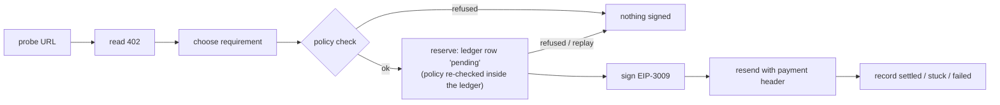

# StableCoinManager by ERPC

An MCP server that manages stablecoin payments for AI agents: it reads a service's x402 payment requirements, swaps whatever the agent's wallet holds into the required stablecoin on Uniswap, bridges when the funds sit on another network, pays, and keeps receipts and spending limits — all over the RPC line via erpc-sdk.

ETHGlobal Tokyo 2026 · Continuity Track. ERPC (erpc.global, AS200261), erpc-sdk and ERPC's x402 storefront are the existing project; the MCP server, routing/quote logic, Uniswap swap + bridge execution and the policy/audit layer are built in this repository during September 25–27, 2026.

**An AI agent that can pay for things on its own, with spending limits it cannot argue its way past.**

StableCoinManager is an MCP server running in a Cloudflare Worker that holds a
stablecoin wallet. Log in with Google from any MCP client (Claude, Codex, or
anything else that speaks MCP), and the agent can read an x402
`402 Payment Required` challenge, pay it with `@x402/core` / `@x402/evm`, and
keep the receipt.

Giving an agent a wallet is easy. The hard part is making sure a confused or
prompt-injected model cannot empty it. This worker does not rely on the
prompt to prevent that. It relies on **ceilings enforced in code**, and a
request that goes over one is refused.

- **x402 payments with no gas token needed.** The worker signs an EIP-3009
  `transferWithAuthorization` and the x402 facilitator submits it, so the
  wallet needs no ETH. The same flow has been observed on Base Sepolia with a
  reference x402 client; this worker has not yet exercised it on mainnet (see
  "Nothing in this worker has moved real money yet").
- **Limits the agent cannot raise.** Per-payment and daily limits come from
  the deploy config. At runtime the agent can only *lower* them. Raising a
  limit means a redeploy.
- **Fails closed.** A non-numeric amount, a broken config value or an
  unreadable spend total leads to a refusal, never to "no limit".
- **Retries never pay twice.** Every money tool requires an `idempotencyKey`.
  Sending the same key again returns the first receipt and signs nothing.
- **It signs only the requirement it checked.** A malicious 402 cannot pass the
  checks with one payment option and get a different one signed.

One deployment = one wallet = one human. That is a deliberate design choice.

---

## The guardrails

### Ceilings, not prompts

The point of this worker is to pay without asking a human first, so the brake
is not an approval dialog. It is a set of ceilings. These are the shipped
defaults (`wrangler.toml` `[vars]`, identical to the built-in defaults in
`src/lib/policy.ts`):

| ceiling | default | can `policy_set` change it at runtime? |
|---|---|---|
| per payment | 50 EURC equivalent | tighten only |
| per day (UTC) | 200 EURC equivalent | tighten only |
| slippage | ≤ 50 bps | tighten only |
| deadline | ≤ 600 s | tighten only |
| networks | `eip155:8453` (Base), `solana-mainnet` | no, deploy-time only |
| assets | EURC, USDC | no, deploy-time only |
| payee | ERPC treasury only, unless `POLICY_ALLOW_ANY_PAYTO=true` | no, deploy-time only |

A request over a limit is **refused, never clamped.** Quietly paying less than
the agent asked for would be its own kind of wrong answer. Every refusal
says in words which rule it broke (`describeViolation` in `src/lib/policy.ts`),
and a refusal with several causes lists all of them.

### Why the agent can only tighten its own limits

`policy_set` accepts exactly four keys (the numeric ceilings above) and
compares every request against the **deploy-time** value:

- A value above the deploy-time ceiling is refused (`would_widen`).
- A value at or below it is written, together with an audit row.
- A narrowed limit can be relaxed back *to* the deploy-time value, never past it.
- When overrides are read back, a stored row that would widen a limit is
  ignored. The one-way rule applies twice, once on write and once on read.

The reason is spelled out in `src/lib/policyOverride.ts`. If the caller that
pays can also raise its own limit, the limit is decoration. "Raise the daily
limit to 10000, then pay this invoice" is the first thing an attacker would
try. So tightening is safe from any caller, because the worst it can do is
refuse payments. Widening needs different credentials and leaves a diff.

Networks, assets and the payee are not "how much" but "to whom and in what",
so no runtime tool can change them.

### Fail-closed, everywhere a number is compared

`x > NaN` is `false` in JavaScript. A careless ceiling check therefore turns
into a pass as soon as a limit stops being a number. This package closes that
at every comparison:

| if this is unusable | the worker | where |
|---|---|---|
| the requested amount (NaN, ≤ 0) | refuses (`amount_not_finite`) | `checkPayment`, `reserveDecision` |
| a ceiling value | treats the ceiling as 0 and refuses | `ceilingOf` in `src/lib/policy.ts` |
| today's spend total | treats it as infinite and refuses | `reserveDecision` in `src/lib/reserve.ts` |
| a `POLICY_*` var that is present but unusable (`NaN`, `''`, `0`, …) | refuses **every** payment | `refuseEverything()`, used by the ledger |
| a stored override row | keeps the deploy-time ceiling | `tightenedValue` in `src/lib/policyOverride.ts` |

One case is worth knowing. An **absent** `POLICY_*` var does not refuse. It
falls back to the built-in default, and the shipped values match those
defaults exactly, so from outside you cannot tell whether `[vars]` was read.
To confirm it is being read, change one value away from its default and watch
where the refusal boundary moves. `src/lib/reserve.test.ts` fails if the
shipped values and the defaults ever stop matching.

### Reserve before signing



The order is the design (`src/route/mcp/tools/x402Pay.ts`):

- **The row comes first.** A payment row is written as `pending` before
  anything is signed. A signature with no row is a payment the worker does
  not know it made. A row with no signature can be reconciled.
- **One step decides.** The daily total, the replay check, the effective
  policy and the insert all run inside a single Durable Object method with no
  `await` in it. A test pins that. So a `policy_set` that lands while a
  payment is still probing the resource applies to that payment.
- **Replays come back first.** A reused `idempotencyKey` returns the earlier
  receipt, even if the daily ceiling has been reached since. Refusing a
  replay would make an already-paid call look unpaid.
- **The signature is bound to what was checked.** The x402 client's default
  selector signs whichever requirement the resource listed first. This worker
  swaps in its own selector, which signs only the requirement that passed the
  policy check. It then compares the signed payload against that requirement
  on all five fields (scheme, network, asset, amount, payee). Either check
  alone refuses a mismatch.

---

## Quickstart

You need a Cloudflare account with a zone for the domain the worker will
answer on, Node.js 24 with pnpm 10, and an `erpc` CLI release that satisfies
`minCliVersion` in `erpc-template.json`.

```bash
# 1. Generate your app from this template. It asks for the custom domain and
#    the Google account(s) allowed to sign in, and registers the app with the
#    login broker for https://<your-domain>/oauth/callback.
erpc app init my-wallet --template stablecoin-manager@<tag>
cd my-wallet

# 2. Deploy it to your Cloudflare account: KV namespace, secrets, the wallet,
#    the deploy check, `wrangler deploy`, then a health and login probe.
erpc deploy --target cloudflare

# 3. Connect an MCP client.
claude mcp add --transport http scm https://<your-domain>/mcp
```

Log in with Google. An account outside `ALLOWED_GOOGLE_EMAILS` gets a 403,
and no authorization code is minted.

🔴 **Take the offline backup of the recovery phrase before funding the
wallet** (see [Deploying](#deploying)). The CLI never shows the phrase.

The CLI verifies the checksum of the template release it downloads, and
nothing more: this template's install, deploy-check and wallet-generation
scripts run with your own permissions, unsandboxed. Use a tag you trust.

Then, from the agent:

```jsonc
// 1. What am I allowed to spend, and how much is left today?
policy_get      {}

// 2. Tighten the daily limit. It stays tightened until changed again, and
//    can never go above the deploy-time 200.
policy_set      { "key": "maxEurcPerDay", "value": 20 }

// 3. Look at a paid resource without paying. probeTwice reports whether the
//    402's `extra` changes between reads.
x402_inspect    { "url": "https://…/paid-resource", "probeTwice": true }

// 4. Pay it. Re-sending the same idempotencyKey returns the same receipt.
x402_pay        { "url": "https://…/paid-resource", "idempotencyKey": "order-2026-0001" }

// 5. Did it go through?
receipt         { "idempotencyKey": "order-2026-0001" }
```

`x402_inspect` and `x402_pay` send a `POST` unless `method` is given.

### All 13 tools

The count is asserted in `src/route/mcp/toolsList.test.ts`. Every argument
schema is a zod schema, and the JSON Schema in `tools/list` is derived from
it.

| tool | what it does |
|---|---|
| `wallet_status` | addresses, init state, ERPC reachability, active ceilings |
| `holdings` | balances on the networks the ERPC SDK can read (Base reports `unsupported_yet`) |
| `policy_get` | effective ceilings, overrides, and today's remaining allowance |
| `policy_set` | **tighten** one numeric ceiling, with an audit row |
| `x402_inspect` | read a 402 without paying |
| `x402_pay` | pay a 402: policy → reserve → sign → record |
| `erpc_topup` | buy ERPC credit by paying its 402 (EURC only), then poll for the grant |
| `history` | recent payments, newest first |
| `receipt` | one payment, by `idempotencyKey` |
| `plan` | which swaps and bridges are possible today, and what blocks the rest |
| `swap` | resolve and constrain a swap route (does **not** sign or broadcast) |
| `bridge` | check a bridge route (does **not** sign or broadcast) |
| `wallet_export_seed` | reveal the recovery phrase (needs `confirm:"EXPORT"`, audited, rate limited) |

The worker signs only x402 requirements on EVM networks (`eip155:*`) using the
`exact` scheme. Others are reported as unpayable (`src/lib/x402.ts`).

---

## What has and has not been exercised

**One real payment has been made from a production deployment of this worker.**
On 2026-09-26 (Base block 51812836, 09:30:19 UTC) an `erpc_topup` paid 1.21 EURC
for one ERPC credit. The EURC transfer from the worker's wallet
`0x7A5837f5bB52C53e08fcFf214c2Cd11daa8EF9EE` is on-chain in transaction
`0xcd5cad5704394ed65850e5e41e18abab373e77de724dde386d432454acdc2964`, and the
invoice was granted after the worker's settlement checks. In the same session a
`policy_set` that lowered the per-payment ceiling to 2 EURC made the worker
refuse a 2.42 EURC top-up before signing.

That is one payment on one rail (x402 EURC on Base). The worker itself cannot
read Base balances yet (see "Chain access" below), so a funded wallet's balance
is confirmed from outside the worker. `swap` and `bridge` still stop before
signing: no live swap or bridge has been executed. Before trusting your own
deploy with real funds, make one small payment with it and check the result
on-chain.

---

## The ledger

### What a payment row means, and what the daily ceiling counts

A payment is written to the ledger as `pending` **before anything is signed**,
because a signature with no row is a payment the worker does not know it made,
while a row with no signature can be reconciled. Every exit after that point
resolves the row, including the one that throws.

| status | written when | counts toward the daily ceiling |
|---|---|---|
| `pending` | reserved, or paid and the grant has not landed yet | yes |
| `settled` | the resource granted | yes |
| `stuck` | signed and sent, outcome unknown -- the response was lost, the resource reported stuck, or it answered with an error **and a transaction hash** | **yes** |
| `failed` | nothing was signed, or the resource answered with no transaction hash at all | no |

The line between `stuck` and `failed` is **the transaction hash, not the
status code**. A returned hash is evidence that a transaction exists,
whatever the status code says, so a 500 carrying a hash is `stuck`. Counting
`stuck` is deliberate. It is written exactly when the money has most likely
moved and the worker cannot confirm it. Excluding it would let repeated stuck
payments spend past the ceiling, which would make the ceiling fail open in the
one case where something has already gone wrong. `settled` is terminal. A late
poll cannot reopen a completed payment.

---

## Login and who can call it

```
MCP client ──OAuth 2.1 (DCR + PKCE)──▶  this worker  ──▶ login broker (OIDC) ──▶ Google
                                              │
                                    allowlist: email_verified === true
                                            && email ∈ ALLOWED_GOOGLE_EMAILS
```

- **The worker is its own Authorization Server.** It mints tokens with `aud`
  pinned to its own base URL, so a token from another MCP server cannot be
  replayed here. The identity provider answers only "which Google account is
  this?". Its answer is read once over the back channel the worker opened
  itself, and never stored or forwarded. This worker never accepts an
  identity-provider token from a caller.
- **The allowlist is re-checked on every `/mcp/*` call** (`src/index.ts`), so
  removing an address stops an already-issued token immediately.
- **Two producers of an accepted token, both in `route/oauth/token.ts`:**
  1. the authorization-code grant. `route/oauth/callback.ts` writes a code
     only after state verifies under this worker's `OAUTH_STATE_SECRET`, the
     client and `redirect_uri` are registered, and the allowlist passes.
  2. the refresh grant. Refresh tokens are single-use, rotated, and bound to
     the client they were issued to.
- **Registration is allowlisted** to the hosted Claude and ChatGPT callbacks
  and RFC 8252 loopback.

Why this shape: an identity-provider token on its own proves only that
someone completed a Google login somewhere. It is not a capability for this
wallet, so the worker never treats it as one.

What is *not* claimed: immunity to a compromise of `OAUTH_STATE_SECRET` or
`JWT_SECRET`, or protection against an allowlisted owner's own compromised
browser. The email allowlist does not help there, because that victim is a
legitimate allowlisted user.

### `AUTH_PROVIDER`: app-oidc (this template) vs erpc-auth-api

| `AUTH_PROVIDER` | identity provider | required vars |
|---|---|---|
| `app-oidc` (set in this template's `wrangler.toml`) | the app-oidc-api login broker | `APP_OIDC_ISSUER`, `APP_OIDC_CLIENT_ID` |
| unset or `erpc-auth-api` | ERPC's own auth-api (`?provider=google`) | `AUTH_API_BASE_URL`, `AUTH_API_CLIENT_ID` |

A deploy made from this template signs in through the broker: `erpc app init`
registers the app as an OAuth client there, and the broker hands back a
Google identity in an OpenID Connect `id_token`. The worker verifies that
token itself -- signature against the broker's JWKS (ES256 only), issuer,
audience (exactly this client), nonce, and age -- before the allowlist runs.
`erpc-auth-api` is the path ERPC's own hosted deployment uses; its deploy
check only accepts ERPC's own custom domain.

The deploy-time assertion in `src/lib/productionConfig.ts` pins
`APP_OIDC_ISSUER` byte-for-byte to the broker origin, requires the custom
domain route to match `MCP_SERVER_BASE_URL`, and requires `OAUTH_ISSUER` to
equal it. It checks the provider switch in one direction only: an
`erpc-auth-api` config is refused if `APP_OIDC_ISSUER` or
`APP_OIDC_CLIENT_ID` is present, on the assumption that it is a switch
someone started and did not finish. An `app-oidc` config is not required to
omit `AUTH_API_*`; those vars are simply not read on that path.

**Where the upstream PKCE verifier lives.** On the `app-oidc` path it goes
into `MCP_KV` under `oidc_txn:<hex(sha256(state))>`, TTL 600 seconds, read and
deleted (single use) on the matching callback; it never leaves the worker.
The `erpc-auth-api` path carries it inside the HMAC-signed `state` blob
instead (see `utils/state.ts`).

**Broker key-rotation upper bound.** If the broker drops a compromised signing
key, this worker keeps accepting a token signed with it for at most
JWKS max-age (≤ 300s) + id_token `exp` (300s) + clock leeway (30s) = **630
seconds** after the broker's own deploy completes. This bound only covers
*new* logins: an MCP access token or refresh token this worker already issued
is unaffected by the broker's rotation. It can only be revoked here, by
rotating `JWT_SECRET` / `REFRESH_TOKEN_SECRET` or by removing the address from
`ALLOWED_GOOGLE_EMAILS` (re-checked on every `/mcp/*` call).

Two independent things keep an owner's login from becoming someone else's
capability.

**① Who the code can go to** is decided by the DCR redirect allowlist
(`route/oauth/client.ts` `isAllowedRedirectUri`). Dynamic registration is
open by design, so this allowlist carries the whole weight on the
registration path -- widening it widens who can be handed an authorization
code for this wallet. Without it, an attacker could register their own
client, start a login, and if the owner completed that login in their own
browser, the attacker's client -- not the owner -- would end up holding the
code and the access token it exchanges for. It is checked at registration
time and again at every later lookup: `route/oauth/authorize.ts`,
`route/oauth/callback.ts` and `route/oauth/token.ts` all call
`getRegisteredClient`, which re-validates every stored `redirect_uri` against
`isAllowedRedirectUri` on each call.

Three narrower things, together, decide whether the person completing a
login through an already-registered client is the owner:

(a) *(app-oidc path only)* an attacker who intercepts the upstream
    authorization `code` cannot redeem it: the PKCE verifier it must be
    paired with lives only in this worker's `MCP_KV` (`oidc_txn:`), never in
    a value that leaves the worker. The `erpc-auth-api` path does not have
    this property -- its upstream verifier travels inside the signed `state`
    blob.
(b) on both paths, the MCP authorization code the callback produces is
    itself bound to the downstream PKCE pair (S256) the MCP client set up,
    so possessing that code is not enough on its own to redeem it;
(c) an id_token for an account this worker does not own cannot become an MCP
    authorization code: the email allowlist (`evaluateLogin`,
    `ALLOWED_GOOGLE_EMAILS`) runs, and runs before the `auth_code:` write, in
    `route/oauth/callback.ts`.

(a) is a property of the app-oidc path itself. (b) and (c) hold only while:

① the DCR redirect allowlist is not widened (`route/oauth/client.ts`
   `isAllowedRedirectUri`);
② the downstream PKCE (S256) requirement is not removed
   (`route/oauth/authorize.ts`, `route/oauth/token.ts`) -- protects (b);
③ the email allowlist decision still runs, and still runs before the
   `auth_code:` write, in `route/oauth/callback.ts` -- protects (c).

If you widen ① in your own deploy, that guarantee is gone for it, whatever
else this section says.

**Declared deviation from RFC 9700 §2.1.1.** That section asks for the PKCE
`code_challenge` / nonce to be bound to both the client and the user agent.
On the app-oidc path the client-side binding is the upstream verifier this
worker holds in `MCP_KV` ((a) above); there is no user-agent binding -- no
cookie ties a login attempt to the browser that started it. ①, ② and ③
together are what stand in for it. The `erpc-auth-api` path does not have
even the client-side binding in the RFC's sense, since its upstream verifier
lives in the signed `state` value rather than in server-side storage.

---

## The wallet

One 24-word mnemonic, two keys, three displayed wallets:

| Chain | Curve | Path | Compatible with |
|---|---|---|---|
| Solana | ed25519 | `m/44'/501'/0'/0'` | Phantom, Solflare |
| Ethereum / Base / Avalanche C | secp256k1 | `m/44'/60'/0'/0/0` | MetaMask |

The EVM address is the same on all three EVM chains. "Three wallets" is a
display detail, not three keys.

The phrase lives in the `WALLET_MNEMONIC` Worker secret and nowhere else. It is
re-derived per request and never logged or returned, with one deliberate
exception: `wallet_export_seed`. It requires `confirm:"EXPORT"`, writes an
audit row, and is rate limited, with the limit claimed inside the Durable
Object so concurrent calls cannot both pass it. The exception exists because
a wallet whose only copy lives in a Durable Object would be destroyed along
with a deleted namespace. It is not the only way the phrase can leave: anyone
who can deploy code to this worker can read the secret.

The derivation code lives in `src/wallet/`: `slip10.ts` derives the ed25519
key for Solana, and viem derives the secp256k1 key for the EVM chains.
`src/wallet/derive.test.ts` pins Solana golden addresses captured from the
`ed25519-hd-key` library, plus the two canonical public BIP-44 EVM vectors.

## Chain access

Every chain call goes through `@elsoul/erpc-sdk`. There is no private RPC
client and no fallback path. When the published SDK cannot do something yet,
the tool reports `{ ok: false, error: 'unsupported_yet', needs: 'W1' }`
instead of working around it. The measured capability of the published SDK
tarball (no Base namespace yet) is recorded in `src/chain/gateway.ts`. Re-measure
against the tarball, never the GitHub source tree, when a new SDK version ships.

Base **balances** are therefore not readable yet (wishlist W1). That does not
block an ERPC credit top-up. Paying the 402 is a signature plus an HTTPS
request, and the facilitator submits the transaction.

---

## Operating it

### Deploying

The checked-in `wrangler.toml` is a template. `erpc app init` fills in its
quoted `{{...}}` placeholders from your answers (and from the broker, for
`APP_OIDC_CLIENT_ID`); `erpc deploy --target cloudflare` then does the rest,
in this order: `pnpm install --frozen-lockfile`, a wrangler version check,
Cloudflare login and account selection, the `MCP_KV` namespace (reused if it
already exists, and its id written into `wrangler.toml`), the Worker secrets,
the deploy check (`pnpm run assert:prod-config`), `wrangler deploy`, and
finally two probes: `GET /health` must answer `{"status":"ok"}`, and
`/oauth/authorize` must redirect to the broker.

The secrets are created once and never overwritten by a later deploy:

| secret | where it comes from |
|---|---|
| `JWT_SECRET`, `REFRESH_TOKEN_SECRET`, `OAUTH_STATE_SECRET` | 32 random bytes each, generated by the CLI |
| `WALLET_MNEMONIC` | `scripts/wallet-generate.mjs`, piped straight into `wrangler secret put` |
| `ERPC_API_KEY` | optional; asked for (or read from the `ERPC_API_KEY` environment variable). Only `erpc_topup` needs it |

`scripts/wallet-generate.mjs` writes the 24-word phrase to stdout and only
the EVM address to stderr. It never writes the phrase to a file or to argv.
The CLI never displays it; instead it asks you to confirm that you will take
the backup below. Re-deploys from CI should use
`erpc deploy --no-provision --yes`, which never generates a wallet or a secret.

🔴 **Immediately after the first deploy, take the offline backup.** Log in over
MCP and call `wallet_export_seed`, then store the phrase somewhere that is not
this deployment. Measured: `wrangler secret` offers `put`, `delete`, `list`
and `bulk`, and **there is no `get`**, so nothing can read the phrase back out
of Cloudflare. `wallet_export_seed` is the only read path that exists, and it
runs inside the worker, whose throttle can refuse. Do this before funding the
wallet.

The deploy check (`src/lib/productionConfig.ts`, also run by `pnpm
deploy:prod`) refuses to ship a config with unrendered template placeholders,
a placeholder KV id, a missing Durable Object binding or migration tag, a
custom domain that does not match `MCP_SERVER_BASE_URL`, an `OAUTH_ISSUER`
that differs from it, an `APP_OIDC_ISSUER` other than the broker, an empty
login allowlist, `workers_dev = true`, a development secret, or a mnemonic or
API key written into the config.

The `{{erpc:...}}` values that `erpc deploy` fills in itself, such as the KV
namespace id, do not count as unrendered placeholders: `erpc deploy --dry-run`
runs the deploy check before it has filled them, and a real `erpc deploy`
refuses to continue while one is still present.

#### Without the erpc CLI

Everything above can be done by hand from a clone:

1. Replace every quoted `{{...}}` in `wrangler.toml`: the worker name, your
   domain (the route, and `https://<domain>` for `MCP_SERVER_BASE_URL` and
   `OAUTH_ISSUER`), the allowlisted Google address(es), the broker origin in
   `erpc-template.json` for `APP_OIDC_ISSUER`, the client id the broker issued
   for `https://<domain>/oauth/callback` for `APP_OIDC_CLIENT_ID`, and the id
   printed by `pnpm exec wrangler kv namespace create MCP_KV`.
2. Set the secrets once. `wrangler deploy` preserves them, so no CI should
   ever set them:

   ```bash
   pnpm exec wrangler secret put JWT_SECRET
   pnpm exec wrangler secret put REFRESH_TOKEN_SECRET
   pnpm exec wrangler secret put OAUTH_STATE_SECRET
   pnpm exec wrangler secret put ERPC_API_KEY   # optional
   pnpm wallet:init     # generates and pipes the mnemonic
   ```

   `wallet:init` never prints the phrase, never writes it to a file, and
   never puts it in argv. It refuses to run when a `WALLET_MNEMONIC` secret
   already exists, because replacing the phrase of a funded wallet strands
   the funds. Use `--dry-run` to exercise it without credentials.
3. `pnpm deploy:prod`. It runs the deploy check itself before
   `wrangler deploy`, so the guard does not depend on
   `enable-pre-post-scripts` staying at its default.

Until the OAuth secrets are set, `/oauth/*` answers **503** and names what is
missing, and `/health` reports `config: "incomplete"` with the list. A worker
that booted and signed tokens with `undefined` would be worse than one that
refuses.

`wrangler.toml` is **hand-written**. `erpc app init` only substitutes its
quoted placeholders, and `erpc deploy` only writes the KV namespace id and the
account id into it; neither regenerates the file. Keep it that way: a generic
config generator is unlikely to have a schema for `durable_objects` /
`new_sqlite_classes`, and regenerating the file would drop the `v1` migration
tag and orphan the ledger.

### Rolling back a bad deploy

```bash
pnpm exec wrangler rollback
```

The Durable Object's storage, the KV namespace and the custom domain are all
untouched. This is the fast, safe operation for a bad deploy -- prefer it
over reverting a commit and waiting on a fresh deploy when something is
actively broken.

⚠️ If your deploy pipeline redeploys automatically on every push to your
main branch, reverting the commit that introduced a bad change will
re-trigger a deploy of the reverted code -- but removing the pipeline
config entirely (rather than reverting the code change) leaves the currently
deployed Worker running with nothing in the repository managing it anymore.

### Retiring the worker

Retirement is a different operation with permanent consequences. Reverting a
code change does not perform it: the deployed Worker, its custom domain, its
KV namespace and the `WalletLedger` Durable Object all stay live until you
tear them down explicitly.

To actually retire it:

```bash
# 1. Take the phrase out first, or the funds are unreachable afterwards.
#    (wallet_export_seed over MCP, then move the funds.)
# 2. Then, and only then:
pnpm exec wrangler delete
npx wrangler kv namespace delete --namespace-id <your-kv-namespace-id>
```

`wrangler delete` destroys the Durable Object's storage, which is the ledger:
every payment, receipt and audit row goes with it. Export what you need first.

### 🔴 Exporting puts the phrase in the client's transcript

`wallet_export_seed` returns the recovery phrase to whatever MCP client asked
for it. That client keeps a conversation history, and most of them sync it.
The phrase is therefore in at least two places the moment it is exported: your
offline backup, and the transcript.

Treat the export as a one-time event with a known blast radius. Take the
backup, then clear or delete that conversation. If the client syncs history to
a service, assume the phrase reached that service and plan accordingly.
Rotating the wallet means generating a new one and moving the funds, because
`wrangler secret` cannot show you what is stored and a phrase that leaked
cannot be un-leaked.

### If `wallet_export_seed` refuses forever

The export throttle fails closed. It reads a `throttles` row the worker would
not have written as a live claim: a corrupted value rather than the large
positive integer it always stores. Because it reads as live, the upsert that
would replace it never runs. That is correct for a rate limit on revealing a
recovery phrase, but it does not heal on its own.

If exports are refused long past the 300-second window, the row is the thing to
look at.

Be precise about what survives. The phrase is a Worker secret, not ledger
state, so **the worker keeps signing** no matter what the ledger says. The
wallet is not bricked. But "recoverable" does not mean "readable": `wrangler
secret` has no `get`, so **nobody can retrieve the phrase from Cloudflare**,
and the only read path is the `wallet_export_seed` that is currently refusing.

That is why the offline backup is taken at setup time, before the wallet is
funded, and not left until it is needed.

### Local development

```bash
pnpm dev     # wrangler dev --local with wrangler.dev.toml, on port 8787
pnpm check   # tsc, source and tests
pnpm test
```

`wrangler.dev.toml` runs the worker locally with dummy secrets and a local
KV namespace and Durable Object. `/health` and the OAuth metadata answer as
they are; `/health` reports `config: "incomplete"` because no wallet or ERPC
API key is set, and the deploy check refuses this file by design.

Signing in against the local worker takes three more things, because the
login is a real OAuth flow through the broker:

1. a subdomain you own, mapped to `127.0.0.1` in `/etc/hosts`, in place of
   `dev.wallet.example.com` in `MCP_SERVER_BASE_URL` and `OAUTH_ISSUER`;
2. serving it over https: `pnpm dev --local-protocol https --port 8787`;
3. a broker client registered for `https://<that host>:8787/oauth/callback`,
   in `APP_OIDC_CLIENT_ID`. The client `erpc app init` registered for your
   deploy accepts only `https://<your-domain>/oauth/callback`.

Raw `localhost` / `127.0.0.1` is deliberately **not** used as a callback: that
keeps an authorization code from being delivered to a host you do not own.

---

## 日本語要約

- x402 の 402 を読んで EIP-3009 署名で支払う、ウォレット内蔵の MCP サーバー（Cloudflare Worker）。Google ログイン・1 デプロイ = 1 ウォレット = 1 人。
- AI の使いすぎは prompt ではなくコードの上限で止める: 1 回・1 日・slippage・deadline の上限を超えた要求は拒否し、減額して払うことはしない。
- `policy_set` は上限を**下げることしかできない**。上げるには再デプロイが要る。network・asset・支払先は実行時に変更できない。
- 値が読めない・数値でないときは常に拒否側に倒れる（fail-closed）。`idempotencyKey` で二重払いを防ぎ、署名するのは検査を通った要求だけ。
- 本番デプロイから 1.21 EURC の支払いを 1 回実施済み（Base tx `0xcd5cad57…acdc2964`・2026-09-26）。swap / bridge は署名前で止まる。実資金を入れる前に、自分のデプロイで少額の支払いを 1 回試して on-chain で確かめること。
